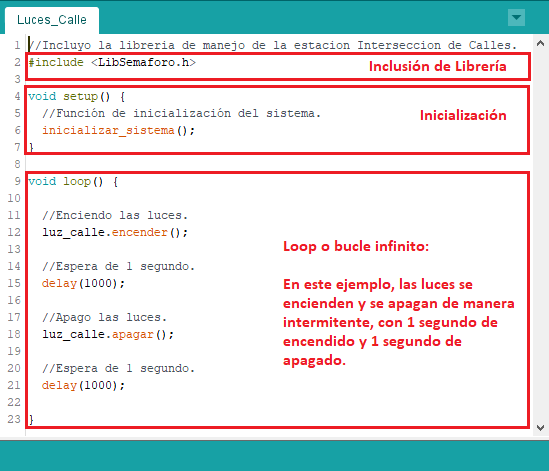

# ESTRUCTURA DE UN PROGRAMA ARDUINO 
- Se dividen en 3 partes 

## DECLARACION DE CONSTANTES
- Seccion opcional donde definimos constantes para todeo el programa 
## SETUP()
- Seccion obligatoria que inclusive si no hay nada dentro de esta, debe estar incluida 
- Sus funciones son las siguientes 
    - Configuracion de los modos de trabajo de los pines
    - Inizializacion de los pines 
    - Configuracion e inicializacio nde las comunicaciones serie 
    - Inicizalizacion de variables 
## LOOP()
-  Seccion obligatoria donde se ejecuta de forma automatica una vez ejecutado el setup 
# PROGRAMACION PRACTICA 
## ENTRADAS Y SALIDAS DIGITALES 
### ``PINMODE()``
- Indicamos si un pin es de salida o entrada
> https://www.arduino.cc/reference/en/language/functions/digital-io/pinmode/

> EJEMPLO 
```arduino
    void setup()
    {
        pinMode(A1, INPUT);
        pinMode(A4, OUTPUT);
    }

```
### ``DIGITALREAD()``
- Realiza la lectura de un pin digital 
> https://www.arduino.cc/reference/en/language/functions/digital-io/digitalread/

- Puede devolver 
    
    - ``INPUT``: Si el pin esta como input puede devolver
        - ``HIGH (1)``: Encendido
        - ``LOW (0)``: Apagado
    - ``INPUT_PULLUP``: Si el pin esta como input puede devolver
        - ``LOW (0)``: Encendido
        - ``HIGH (1)``: Apagado
### ``DIGITALWRITE()``
- Escribe el valor de un pin que esta configurado como salida
> https://www.arduino.cc/reference/en/language/functions/digital-io/digitalwrite/
## ENTRADAS Y SALIDAS ANALOGICAS
### ANALOGREAD()
- A diferencia de los pines digitales(solo es 0 o 5V) el analogico trabaja en un rango de 0 a 1023 (0 a 5V)
- No son necesarios configurarlos en la sentencia pinMode porque son pines de entrada analogica
### ANALOGREADRESOLUTION()
> https://www.arduino.cc/reference/en/language/functions/zero-due-mkr-family/analogreadresolution/
### ANALOGWRITE()
- Escribe valores en un pin PWM (En otras placas puede especificar un pin especial para salida analogica)
> https://www.arduino.cc/reference/en/language/functions/analog-io/analogwrite/
### ANALOGWRITERESOLUTION()
> https://www.arduino.cc/reference/en/language/functions/zero-due-mkr-family/analogwriteresolution/
## GESTION DEL TIEMPO
### DELAY 
- Permite realizar paradas de ejecucion
> https://www.arduino.cc/reference/en/language/functions/time/delay/
### DELAYMICROSECONDS()
- Lo mismo que delay
>https://www.arduino.cc/reference/en/language/functions/time/delaymicroseconds/
### MILIS()
- Cuenta el tiempo en milisegundos ejecutandose arduino
- Se resetea a los 50 dias
> https://www.arduino.cc/reference/en/language/functions/time/millis/
### MICROS()
- Cuenta el tiempo en microsegundos ejecutandose arduino
- Se resetea a los 70 minutos
## COMUNICACION SERIE
- Es puerto serie permite la comunicacion entre la placa con el ordenador
### BEGIN()
- Inicializa el canal serie
- Normalmente la comunicacion es a 9600
>https://www.arduino.cc/reference/es/language/functions/communication/serial/begin/
### ENG()
- Finaliza la comunicacion serie 
### INSTRUCCIONES DE ENVIO 
#### SERIAL.PRINT 
- Envia informacion parametrizada 
- Segundo parametro 
    - BIN Info en binario
    - OCT Info en octal
    - DEC Info en decimal
    - HEX Info en hexadecimal
> https://www.arduino.cc/reference/es/language/functions/communication/serial/println/
#### SERIAL.PRINTLN
- Lo mismo pero hace un salto de linea
#### SERIAL.WRITE 
- Envia info que ocupa 1 byte o serie de bytes.
- Debe ser de tipo byte, array de bytes, string
> https://www.arduino.cc/reference/en/language/functions/communication/serial/write/
>https://youtu.be/CWprc3w6PQE?t=277
### INSTRUCCIONES DE RECEPCION
#### SERIAL.AVAILABLE 
- Devuelve el numero de bytes para ser leidos en arduino.Los bytes son almacenados temporalmente en un pequeno buffer de 64 bytes 
#### Serial.read 
- Realiza la lectura del primer byte  y este es eliminado. Si no hay bytes, devuelve -1 
#### Serial.peek 
- Realiza la lectura del primer byte y lo devuelve despues de ejecutarse. Si no hay bytes, devuelve -1 
#### Serial.find 
- Hace lecturas hasta encontrar una cadena de texto. Va eliminando los datos hasta encontrar la cadena o se queda sin bytes que leer. Si la encuentra devuelve TRUE, o en caso contrario FALSE
#### Serial.finduntil 
DUDA
- Es lo mismo que la anterior solo que teien un parametro mas. Este indica que la instruccion se detendra cuando encuentre el texto, llegue al final de la cadena o encuentre la cadena de final de busqueda 
#### Serial.readBytes
- Lee un determinado numero de bytes y los elimina y devuelve el numero de bytes leidos
#### Serial.readBytesUntil
- Lo mismo que el anterior pero con un parametro nuevo que si encuentra una cadena de texto parara la lectura
#### Serial.readString 
- Realiza la lectura y devuelve en formato string y los elimina del buffer. Podemos definir un tiempo de ejecucion con Serial.setTiemout
#### Serial.setTimeout
- Define una determinada cantidad de segundos en donde los siguientes codigos tendran que esperar para recibir nuevos datos y una vez superado ese tiempo la instruccion es finalizado
    - Serial.readBytes
    - Serial.readBytesUntil
    - Serail.readString 
#### Serial.parseFloat 
-  Realiza la lectura hasta encontrar un numero decimal, elimina los bytes previos y devuelve el decimal encontrado 
#### Serial.parseInt 
- Lo mismo que el anterior pero con un numero entero
### CARACTERES 
#### isAlpha(caracter) 
- Comprueba si el carater es letra o no
#### isAlphaNumeric(caracter)
- Comprueba si el caracter es alfanumerico o no 
#### isAscii(caracter)
- Comprueba si el caracter es ascii
#### isControl(caracter)
- Comprueba si el caracter es caracter de control o no
#### isDigit(caracter)
- Comprueba si el caracter es digito o no 
#### isGraph(caracter)
- Comprueba si el caracter es legible o no 
- Los espacios en blanco no son legibles 
#### isHexadecimalDigit(caracter)
- Comprueba si el caracter es un digito hexadecimal (A-F,0-9)
#### isLowerCase(caracter)
- Comprueba si el caracter es una letra minuscula o no 
#### isPrintable(caracter)
- Comprueba si el caracter es imprimible o no 
- Los espacios son imprimibles 
#### isPunct(caracter)
- Comprueba si el caracter es un signo de puntuacion o no 
#### isSpace(caracter)
- Comprueba si el caracter es un espacio o no 
#### isUpperCase(caracter)
- Comprueba si el caracter es mayuscula o no


