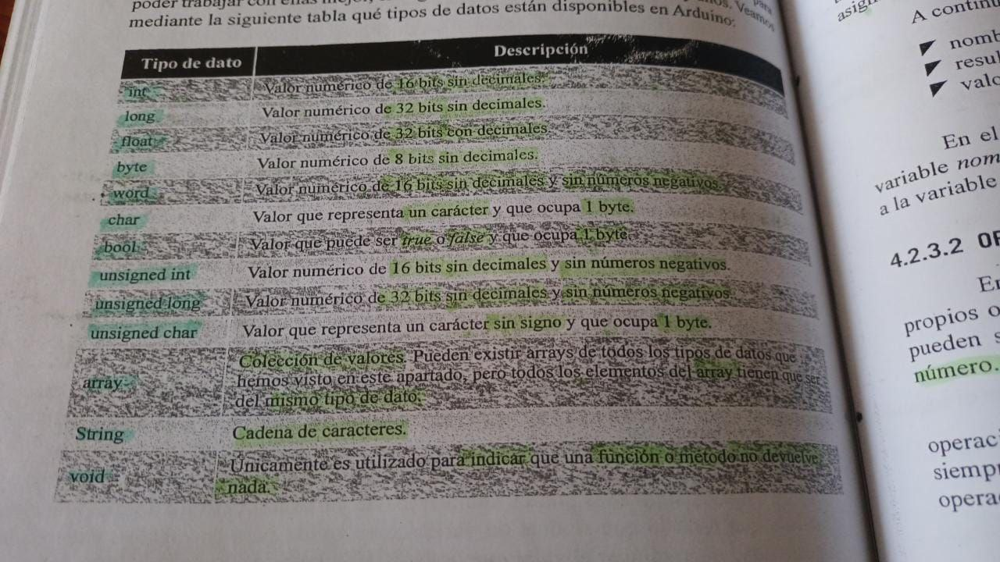

# VARIABLES 
- Datos que residen en la memoria del ordenador y son utilizado para la ejecucion de programas 

- Una constante se mantiene su valor en cambio una variable cambia 

## CARACTERISTICAS 
### NOMBRE
- Identificador
### TIPO 
- Puede ser variables o constantes 
### VALOR 
- Tanto como las variables o como constantes almacenan valores 

# TIPOS DE DATOS 


# OPERADORES 
## ASIGNACION `=`
## ARITMETICOS `+ - / *`
## OPERADORES RELACIONALES 
- Permite comprobar condiciones 

|OPERADOR|SIGNIFICADO   |
|---|---|
| `<` | MENOR QUE   |
| `>`  | MAYOR QUE  |
| `<=`  | MENOR O IGUAL QUE   |
| `>=`  | MAYOR O IGUAL QUE  |
| `!=`  | DISTINTO QUE |

## OPERADORS LOGICOS 
### AND `&&`
### OR  `||`
### NOT `!`

# BIFURCACIONES 
## IF E IF/ELSE
[IF-LINK REFERENCE](https://www.arduino.cc/reference/en/language/structure/control-structure/else/)

## SWITCH
- Se compone de 
    - `SWITCH` Indica el comienzo de la estructura de la bifurcacion switch
    - `CASE` Indica un camino dentro de switch
    - `BREAK` Indica el fin de un camino 
    - `DEFAULT` Indica un camino por defecot en caso que no tome el anterior

[SWITCH-LINK REFERENCE](https://www.arduino.cc/reference/es/language/structure/control-structure/switchcase/)

# BUCLES
## FOR 
- Lo compone 
### VARIABLE 
### CONDICION 
- Es el numero de iteracion del bucle 
### VALOR 
- En el que incrementa la variable 
> EJEMPLO 

```arduino
for(int i=0;i<10;i=i+1){

}
```
## WHILE 
## DO
[BUCLE-WHILE-LINK REFERENCE](https://www.arduino.cc/reference/en/language/structure/control-structure/while/)

[BUCLE-DO-LINK REFERENCE](https://www.arduino.cc/reference/es/language/structure/control-structure/dowhile/)

# FUNCIONES
- Lo compone 

    ``TIPO DE RETORNO  NOMBRE DE FUNCION (PARAMETROS) ``

## TIPO DE RETORNO 
- Es el resultado que devolvera la funcion
- Si es vacio escribimos ``void``

## PARAMETROS 
- Es el conjunto de elementos separados por comas los cuales usaremos en la funcion
- Debemos especificar el tipo de dato junto al nombre 
>EJEMPLO 
```arduino 
    int CalcularPotencia (int base, int exponente)
    {
        if(exponente == 0){
            return 1;
        }
        else
        {
            int resultado = base;
            for(int i=1; i<exponente;i=i+1){
                resultado =resultado*base;
            }
            return resultado;
        }
    }
```
 - Podemos usarlo  a lo largo del codigo tantas veces como queremos 
 ```arduino 
 int resultado = CalcularPotencia(2,3);
 ```
 # COMENTARIOS DEL CODIGO 
 ## COMENTARIOS DE UNA LINEA ``//``
 ## COMENTARIOS DE BLOQUE ``/* */``
