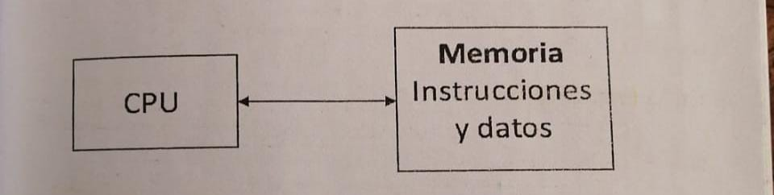
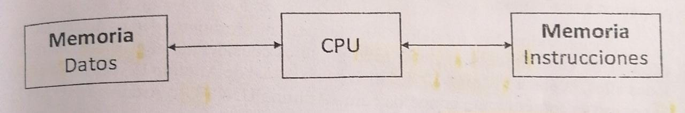
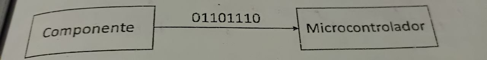
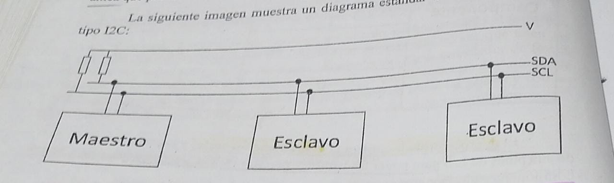
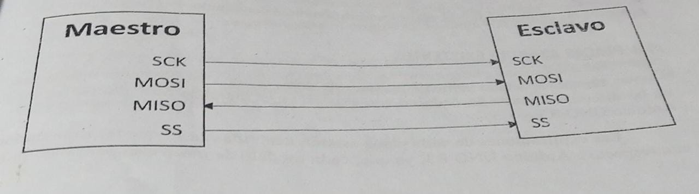
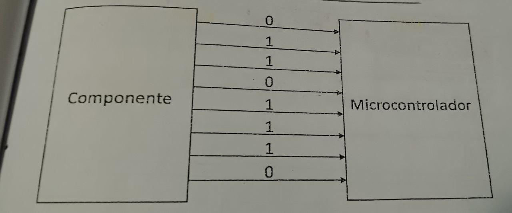
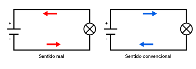
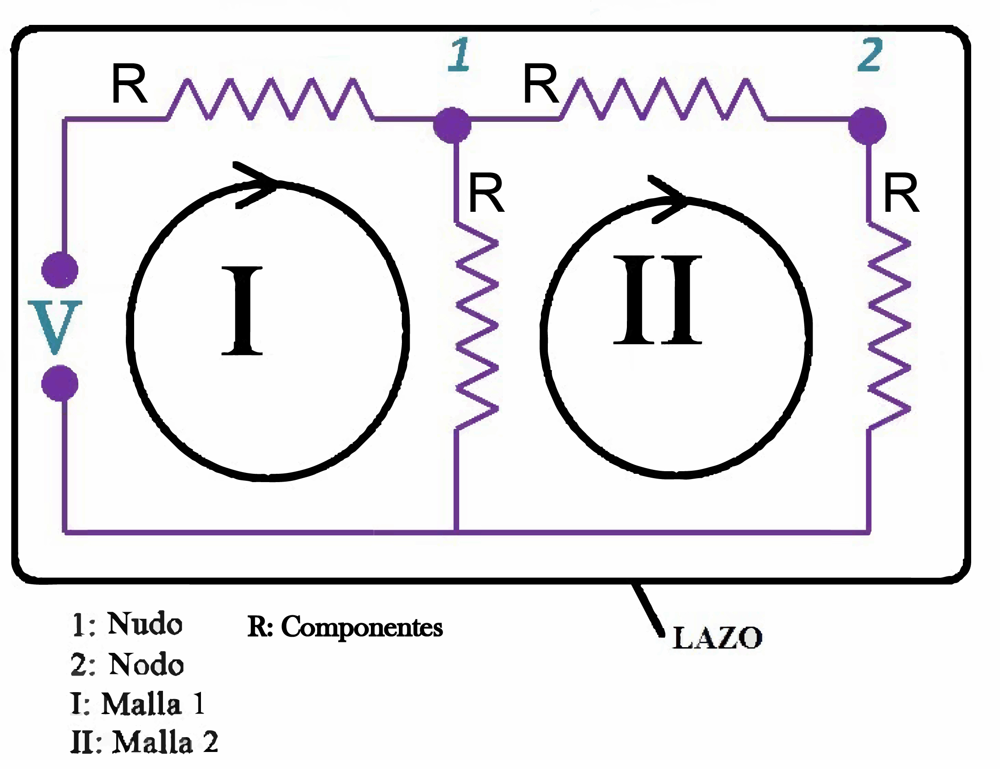
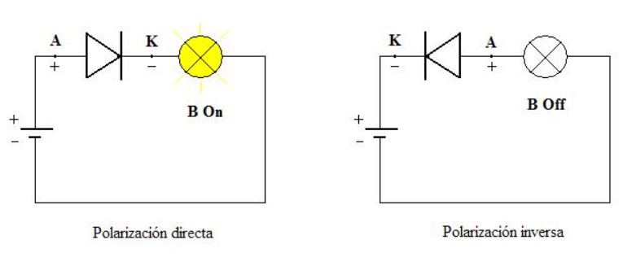
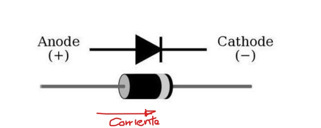

# 💙 **ARDUINO TEORY HARDWARE**

## 💙 ***Que es un sistema electronico?***

Es un conjunto de componentes relacionados entre si que contribuyen a un determinado objeto

Desde la eletronica, es un conjunto de sensores, actuadores, circuiteria de procesamiento y control y fuente de alimentacion:

**SENSORES**

Son componentes que transforman lo que ocurre en el mundo fisico en senales electricas

**ACTUADORES**

Son componenetes que interactuan con el mundo fisico externo a la placa

**CIRCUITERIA**

Procesan la senal que reciben de los sensores y envian la senal electrica a los actuadores 

**FUENTE DE ALIMENTACION**

Proporciona energia

## 💙 ***Que es un microcontrolador?***

- Es un circuito integrado programable.
- Es el componente mas importante de la circuiteria de procesamiento y control
- Un microcontrolador se diferencia de un microprocesador en que un microcontrolador es un sistema cerrado ya que integra en si mismo todos los componentes en un mismo sistema. Un microprocesador es un sistema abierto
- El microcontrolador tiene un conjunto de elementos basicos que lo consideran un microcontrolador:
    - **ENTRADAS Y SALIDAS**
        - Comunica al microcontrolador con el exterior
            - **ENTRADA:** Sensores
            - **SALIDA:** Actuadores
            - **ENTRADA Y SALIDA:** Sensores y actuadors
    - **CPU**
        - Ejecuta instrucciones
    - **MEMORIA**
        - Almacena informacion
            - **MEMORIA PERSISTENTES**
                - Almacena infomacion de forma permanente
            - **MEMORIA VOLATILES**
                - Almacena informacion hasta que deja de recibir alimentacion electrica
    
    ---
    

## 💙 *Arquitectura de **un microcontrolador?***

- La arquitectura de un microcontrolador es la forma en la que se disena el microcontrolador, tanto a nivel fisico como de funcionamiento.
- Las **principales arquitecturas de microcontrolador** que existe son las siguientes
    
    > **OJO:** El ancho de bus es la cantidad de inforamcion que se puede transferir por unidad de tiempo
    > 
    - **ARQUITECTURA DE VON NEUMANN**
        
        
        
        - El tamano de la unidad de datos y de instrucciones esta fijada por el tamano del ancho de bus
    - **ARQUITECTURA DE HARDVARD**
        
        
        
        - A la memoria de instrucciones es llamada **"Memoria de programa"** y unicamente almacena instrucciones del programa que ejecuta la CPU
        - A la memoria de dato es llamada **"Memoria de datos"** y alamacena unicamente los datos que utiliza la CPU
- Estas arquitecturas pueden utilizar cualquiera de los direntes tipos de procesadores que exiten:
    - **PROCESADORES CISC**
        - Permiten manejar un conjunto complejo de instrucciones
    - **PROCESADORES RISC**
        - Utilizan un conjunto reducido de instrucciones
    

---

## 💙 *Placa Arduino*

- Arduino uno es uno de los modelos mas utilizados.
- Tiene las siguientes caracteristicas
    - **ALIMENTACION**
        - Se alimenta a 5 voltios
            - **Fuente externa**
                - Recibe entre 6 y 20 voltios y se regula a 5v mediante un circuito regulador
            - **USB**
                - Recibe 5v. Cuando recibe una tension superior se detiene la conexion mediante un polifusible reseteable hasta que se restauren los 5v
                - Tiene las siguientes funciones
                    - Alimentacion
                    - Carga de programas
                    - Envio de informacion
            - **Puerto de alimentacion**
                - Para alimentarlo debe estar previamente regulado a 5v
    - **ELEMENTOS DE ARDUINO**
        - **Entradas y salidas**
            - **Entradas y salidas digitales**
                - Son pines enumerados del 0 al 13
                - Estos pines son conocidos comunmente como GPIO("General Purpose Input/Output")
                - Su funcion principal es conectarse con sensores y actuadores para enviar y recibir informacion a estos
                - Funcionan a 5v y segun su intensidad reciben un amperaje de 100 mA en 2 grupos de pines del 0 al 4 y del 5 al 13 con un amperaje maximo de 40 mA
            - **Entradasy salidas analogicas**
                - **Entradas analogicas**
                    - Son los pines del A0 al A5
                    - Reciben valores de voltaje de 0v a 5v
                    - En la vida real arduino no trabaja con entradas analogicas. Al recibir senales analogicas, Arduino las transforma con un circuito conversor analogico/digital
                        - La presion de este circuito conversor es determinado con el numero de bits(a mayor numero de bits, mayor presion)
                    - Podemos usarlos como entradas y salidas digitales al enumerarlos en el ide del 14 al 19
                - **Salidas analogicas**
                    - Tienen el simbolo ~ (PWM-Pulse width modulation)
                    - Son simuladas por las entradas y salidas digitales variando la frecuencia y la ancjura de los pulsos simulando una tension de forma continua
            - **Pines de alimentacion**
                - Son los siguientes
                    - **3.3v**
                        - Es regulado por el microcontrolador LP2985
                        - Por cualquier fuente de alimentacion puede ser obtenido este pin
                    - **5v**
                        - Alimentan a la placa y a los componentes electronicos
                    - **GND**
                        - Es el ground
                    - **Vim**
                        - Alimenta componentes electronicos sin regular
                        - Tiene una propia alimentacion de la fuente con una fuente externa, la cual es regulada con  el regulador de tension incorporado en la placa
            - **Pines con doble funcion**
                - Son los siguientes
                    - **Pin 0(RX)**
                        - Recibe datos sin pasar por el conversor USB-Serie
                    - **Pin 1(TX)**
                        - Envia datos sin pasar por el conversor USB-Serie
                    - **Pin 2 y 3**
                        - Gestionan interrupciones
                    - **Pines de protocolo SPI**
                        - **Pin 13:** SCK
                        - **Pin 10:** SS
                        - **Pin 11:** MOSI
                        - **Pin 12:** MISO
                    - **Pines con protocolo I2C**
                        - **Pin A5:** SDA
                        - **Pin A4:** SCL
            - **Otros pines**
                - **IOREF**
                    - Indica a las placas supletorias conectadas a nuestra placa el voltaje de nuestra placa
                - **Reset**
                - **Aref**
                    - Aumenta la presion de entradas analogicas ofreciendo un voltaje de referencia externo
                - **Pin sin uso**
    - **MICROCONTROLADORES DE ARDUINO**
        - **AVR**
            - Significa Advance Virtual Risc y es de la marca atmel
            - Es la arquitectura del microcontrolador que incorpora todas las placas arduino
            - Es de tipo hardvard
            - Instrucciones ejecutadas mediante segmentacion en 2 etapas. Mientras se ejecuta una instruccion, otraesta siendo buscada y siendo preparada para ser ejecutada
            - Tiene disponibles 32 registros de 8 bits
            - Conjunto de instrucciones implementadas de forma fisica al microcontroladores
            - Conjunto de registros y memorias que conformanun espacio de direcciones unificado accesible con operaciones de carga y almacenamiento
        - **Registros**
            - Los registros son espacios de memoria para la CPU que almacenan de forma temporal informacion que es utilizada para la ejecucion de las instrucciones o para almacenar el resultado de la ejecucion de las instrucciones
            - El numero de bits que quepan en cada registro indicara las prestaciones de dicho microcontrolador. A mayor numero de bits, mayor prestaciones
        - **Memorias**
            - Los microcontroladores avr tienen las siguientes memorias
                - Memorias de programa
                    - **Memoria flash** (32KB-pero solo disponible 512 debido al gestor de arranque)
                    - **Memoria de datos**(pueden ser ampliados)
                        - **Memoria SPRAM** (Memoria volatil-2KB)
                        - **Memoria EPROM** (Memoria persistente-1KB)
        - **Firmware**
            - Es el gestor de arranque de la memoria flash
            - El primer segundo del reinicio se ejecuta el firmware y luedo se ejecuta los programas almacenados
            - Si la placa no viene con el firmware, con un programador ISP puedes cargarle a la memoria flash
        - **Comunicacion con los componentes electronicos**
            - Para que se comunique un microcontrolador con un componente electronico existen 2 formas
                - **Comunicacion serie**
                
                    - Los bits son trasmitidos de uno a uno
                    - Existe un unico canal de trasmision
                    - Arduino emplea esta forma de comunicacion
                    - Tipos de protocolos de comunicacion en serie
                        
                        > **OJO:Maestro**:Inicia la trasmision y genera la senal de reloj **Esclavo:**Es el destino de la comunicacion
                        > 
                        
                        > **OJO:Senal de reloj:** Es una senal binaria que comunica a elementos integrantes en una comunicacion cuando comienza termina y dura la comunicacion. Es periodica y precisa
                        > 
                        - **I2C**
                            
                            
                            
                            - Inter Integrate-Circuit es un protocolo sincronico que utiliza 2 cables para la comunicacion:
                                - **SCL:**Reloj
                                - **SDA:**Datos
                            - Tiene half duplex que consiste en comunicar elementos con una trasmision unica, en un sentido y al mismo tiempo
                        - **SPI**
                            
                            
                            
                            
                            
                            - Serial Peripheal Interface es u protocolo sincrono de trasmision que utiliza 4 cables para la comunicacion
                                - **SCK:** Envia senales de reloj
                                - **SS:** Indica el esclavo destino(solo puede indicar uno)
                                - **MOSI:** Envia datos al esclavo
                                - **MISO:** Envia datos del esclavo al maestro
                            - Tiene full duplex que basicamente consiste en la trasmision simultania, es deir en ambos sentidos
                            - La principal ventaja a diferencia de el I2C es que este es mas rapido y eficiente en terminos de energia pero en consecuencia se necesita mas pines E/S para comunicarses ya que el numero de lineas SS depende del numero de elementos que haya en el circuito
                        
                - **Comunicacion paralelo**
                
                    - Los bits son trasmitidos de forma sincronizada y simultanea
                    - Existen varios canales de trasmision

## 💙 ***Concepto de electricidad***

- Es el movimiento de electrones por un medio conductor

**ATOMO EN EQUILIBRIO**

- Misma cantidad de cargas positivas y negativas

**COMPENSACION DE CARGAS**

- Lo que se busca cuando hay una cantidad excesiva de electrones
- El movimiento de electrones depende del tipo de material
    
    **Material contuctor**
    
    - Permite el flujo de la corriente electrica en el
    
    **Material aislante**
    
    - Impide el paso de la corriente electrica

**ELECTRICIDAD ESTATICA**

- Se produce cuando los electrones no pasan de un atomo a otro
- Es posible convertirla a corriente electrica mediante la descarga de un circuito

**ELECTRICIDAD POR FRICCION**

- Se manifisesta la friccion estre 2 materiales

## 💙 ***Magnitudes electricas***

- Nos ayuda a comprender la energia electrica que esta circulando
    
    
    | Magnitud electrica | Unidad de medida |
    | --- | --- |
    | Intensidad(I) | Amperio(A) |
    | Tension(V) | Voltios(V) |
    | Resistencia(R) | Ohmios(Ω) |
    
    **TENSION**
    
    - Mide la diferencia de cargas
    
    **INTENSIDAD**
    
    - Mide la cantidad de electrones o carga electrica que pasa por un punto en un tiempo determinado
    
    $I=Q/t$
    
    **SENTIDO DE INTENSIDAD**
    
    - Por comodidad al punto de circuito que tiene mayor carga negativa o menor potencial se le da un valor de referencia 0
    
    
    
    **RESISTENCIA**
    
    - Oposicion al paso de los electrones
        
        **Material conductor**
        
        - Menor resistencia
        
        **Material aislante**
        
        - Mas resistencia
        
    **LA RESISTIVIDAD ( $\rho$ )**            
        
    - Mide la dificultad que presenta una sustancia para conducir la corriente electrica. 
        
        $$ \rho = \rho _0 (1+\alpha \Delta T) $$ 
        
        Donde 
        
        $\rho _0$ : Resistividad a 0°C

        $\alpha$ : Coficiente propio de cada material 

        $\Delta T$ : Diferencia de temperatura con respecto a 0°C 
     
    **FACTORES QUE DEPENDE LA RESISTENCIA**
    
    - Tipo de material
    - Temperatura / Resistencia
    - Longuitud del material Superficie
    - Seccion Resistencia

    **POTENCIA**
    
    - Es la energia electrica consumida (E)  en una unidad de tiempo (T)

    $$ P=E/t $$
    $$ P=I.V $$

    ## 💙 ***LEY DE OHM***

    $$ V=  I.R $$

    ## 💙 ***CORRIENTES***
    **CORRIENTE CONTINUA**
    
    - Los electrones circuilan siempre en el mismo sentido mantenitendo su polaridad

    **CORRIENTE ALTERNA**
    - Los electrones se mueven alternativamente entre el polo positivo y negativo. 
    - Ocurre tantas veces como frecuencia en herts (Hz) tenga esa corriente
    - Se caracteriza por ser una corriente facilmente transportada a grandes distancias y llega a nuestros enchufes a travez de la red
    - Mediante transformadores la corriente alterna sera transformada en corriente continua 

    

    ## 💙 ***CIRCUITOS ELECTRICOS***

    - Dispositivos unidos por un material conductor en donde circula corriente electrica. 
    - Los componentes de los dispositivos son representados por una simbologia universal 
    - Estan formados por: 
        - **PILAS**
        - **RESISNTENCIAS**
        - **DISPOSITIVOS DE CONTROL** Abren o cierran el circuito electrico
        - **RECEPTOR** Recibe la corriente electrica

    ### TIPOS DE CONEXIONES
    #### CONEXION EN SERIE
    - Cuando los dispositivos estan conectados uno a continuacion de otro
    $$ I_T = I_1 = I_2 =...=I $$
    $$ V_T = V_1 + V_2 + ... + V_n $$
    #### CONEXION EN PARALELO
    - Los dispositivos se conectan uniendo todas las entradas por un lado y todas las salidas por otro 
    $$ V_T = V_1 = V_2 =...=V_n $$
    $$ I_T = I_1 + I_2 + ... + I_n $$   
    #### CONEXION EN MIXTO 
    - Presenta tanto conexiones en serie como en paralelo 
    - El circuito tendra mas de dos dispositivos

    ### LEY DE KIRCHHOFF
    - Son 2 reglas para complementar la ley de Ohm 
    - Hay que entender los siguiente
        - **NUDO** Punto del circuito en el cual se unen dos o mas elementos 
        - **MALLA** Circuito que puede recorrerse sin pasar dos veces por el mismo punto 
        - **RAMA** Conjunto de elementos conectados entre dos nudos  
      
      
      
    [LEY DE KIRCHHOFF](https://www.youtube.com/watch?v=m9XVO983_Vg)

     ## 💙 ***COMPONENTES ELECTRONICOS***
     ### PILA
     - Genera una diferencia de potencial 
     - Para alimentar a una placa arduino el regulador necesita un voltaje minimo de 6.5V-7V para proporcionar  5V
     ### DIODO
     #### SEMICONDUCTOR
     - Material que se comporta como un conductor(conduce corriente electrica) y otras veces como aislante(no conduce corriente electrica)
     #### IONIZACION 
     - Cuando un atomo pierde equilibrio de cargas por el movimiento de un electron de su respectiva capa(mayormente sucede en la ultima capa o orbita), pasando a tener mas carga positiva que negativa, convirtiendose en un ion positivo o cation. De forma inversa seria un ion negativo o anion
     - Los semiconductores, los atomos estan compartiendo los electrones de su ultima capa de 2 en 2. Uno del par sera arrancado y se rompera el enlace
     #### DIODO 
     - Es un semiconductor que actuara como conductor en un sentido en determinadas condiciones 
    
    
    
    |Tipo N | Tipo P   |
    |---|---|
    |Silicio o Germanio: Ambos 5 electrones ultima capa de impurezas donde 4 enlaces(2 electrones por cada enlace) y el restante electron libre   | 3 electrones ultima capa de impurezas donde 3 enlaces(2 electrones por cada enlace) deja restante un huco para ser ocupado  |

    #### DIODO LED 
    - Emite luz por el paso de corriente electrica
    - Valores entorno 2V para mas resistencia 
    - Ahorra mas energia que un foco convencional(20% bombilla y 80% el led)
    - Se puede conectar en un pin digital como analogico
    
    
    #### LED RGB 
    - Son 3 led en un encapsulado comun(intensidad no superior a $20mA$)
        - El led rojo requiere 2.1 V
        - El led verde y azul requiere 3.3 V
    - Pueden ser anodo comun o catodo comun
    

    ### RESISTENCIA 
    - Se opone al paso de la corriente 
    - La tolerancia es la precion del valor de la resistencia
        - Cuanto menor sea la tolerancia mas preciso sra el valor de la resistencia
    

    ### POTENCIOMETRO
    - Resistencia variable
    