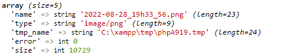
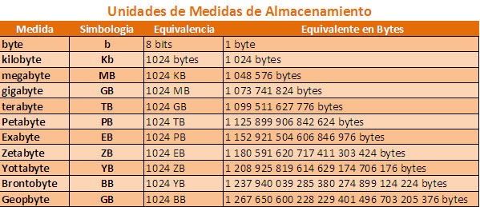
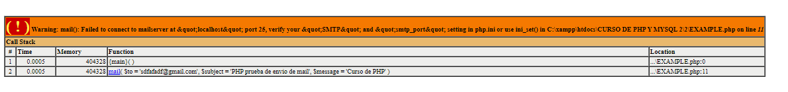
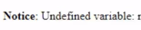
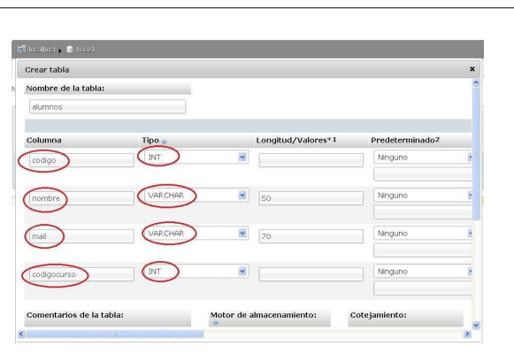
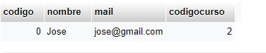
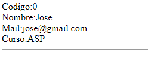
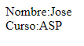

# TEMA 1 - SUBIR ARCHIVOS AL SERVIDOR
## PROYECTO1: SUBIR ARCHIVOS AL SERVIDOR
1. Creando formulario
```html
<html>
<head>
<meta charset="utf-8">
<title>Mi primera pagina</title>
</head>
<body>
<form action="subearchivo.php" method="post" 
enctype="multipart/form-data">
<!--El modo de encriptacion es importante(enctype)porque nos permite subir los archivos 
Basicamente estamos especificando que estamos trabajando con informacion y no solo con inputs tradicionales-->
<b>Campo de tipo texto:</b>
<br>
<input type="text" name="cadenatexto" size="20" maxlength="100">
<input type="hidden" name="MAX_FILE_SIZE" value="100000">
<br>
<br>
<b>Enviar un nuevo archivo: </b>
<br>
<!--El tipo input userfile nos permitira usar el boton para subir el archivo-->
<input name="userfile" type="file">
<br>
<input type="submit" value="Enviar">
</form>
</body>
</html>

```
2. Creando el archivo donde se procesara el formulario
```php
<!doctype html>
<html>
<head>
<meta charset="utf-8">
<title>Mi primera pagina web</title>
</head>
<body>
<?php
//tomo el valor de un elemento de tipo texto del formulario
$cadenatexto = $_POST["cadenatexto"];
echo "Escribió en el campo de texto: " . $cadenatexto . "<br><br>";
//datos del arhivo
$nombre_archivo = $_FILES['userfile']['name'];
$tipo_archivo = $_FILES['userfile']['type'];
$tamano_archivo = $_FILES['userfile']['size'];
//compruebo si las características del archivo son las que deseo (en 100000 es 100kb)
if ((strpos($tipo_archivo, "gif") || strpos($tipo_archivo, "png")) && ($tamano_archivo < 100000)) { 
if (move_uploaded_file($_FILES['userfile']['tmp_name'], $nombre_archivo)){
echo "El archivo ha sido cargado correctamente.";
}else{
echo "Ocurrió algún error al subir el fichero. No pudo guardarse.";
}
}else{
echo "La extensión o el tamaño de los archivos no es correcta."; 
echo "<br>Se permiten archivos .gif o .jpg.";
echo "<br>Se permiten archivos de 100 Kb máximo.";
}
?>
</body>


```
- ``move_uploaded_file``
>MORE UPLOADED FILE https://www.php.net/manual/es/function.move-uploaded-file.php

- Si escribimos ``var_dump($_FILES['userfile']);`` nos va a aparecer el tipo de archivo que estamos subiendo y donde lo estamos subiendo


- Para establecer un limite de subida del formulario en general escribimos ``max_file_size``
>https://www.sitepoint.com/community/t/setting-max-file-size-in-html/8577/3

- Unidades de medida


## PROYECTO2: SUBIENDO ARCHIVOS AL SERVIDOR
1.  Creando el formulario
```html
<!DOCTYPE html>
<html lang="en">
<head>
    <meta charset="UTF-8">
    <meta http-equiv="X-UA-Compatible" content="IE=edge">
    <meta name="viewport" content="width=device-width, initial-scale=1.0">
    <title>Document</title>
</head>
<body>
    <form action="UPLOAD.php" method="post" enctype="multipart/form-data">
        <input type="hidden" name="max_size_file" value="10000">
        Sube tu archivo
        <input name="userfile" type="file">
        <input type="submit"value="Enviar">
    </form>
</body>
</html>
```
2. Creando el php del formulario
```php
<!DOCTYPE html>
<html lang="en">
<head>
    <meta charset="UTF-8">
    <meta http-equiv="X-UA-Compatible" content="IE=edge">
    <meta name="viewport" content="width=device-width, initial-scale=1.0">
    <title>Document</title>
</head>
<body>
    <?php
        $name_file=$_FILES['userfile']['name'];
        $type_file=$_FILES['userfile']['type'];
        $size_file=$_FILES['userfile']['size'];
        echo "El nombre del archivo es: $name_file <br>";
        echo "El tipo del archivo es: $type_file<br>";
        echo "El tamano del archivo es: $size_file<br>";
        if(move_uploaded_file($_FILES['userfile']['tmp_name'],$name_file)){

            echo 'The file was uploaded correctly';
        }
        else{
            echo "The file wasn't uploaded correctly";
        }
    ?>
</body>
</html>
```
## PROYECTO3: SUBIENDO ARCHIVOS DE TEXTO A UNA CARPETA ESPECIFICA
1. Haciendo el formulario 
```html
<!DOCTYPE html>
<html lang="en">
<head>
    <meta charset="UTF-8">
    <meta http-equiv="X-UA-Compatible" content="IE=edge">
    <meta name="viewport" content="width=device-width, initial-scale=1.0">
    <title>Document</title>
</head>
<body>
    <form action="UPLOAD.php" method="POST" enctype="multipart/form-data">
        <input type="hidden" name="max_value_file" value="10000">
        Upload your files 
        <input type="file" name="userfile">
        <input type="submit" value="Enviar">

    </form>
</body>
</html>
```
2. Haciendo el upload
```php
<!DOCTYPE html>
<html lang="en">

<head>
    <meta charset="UTF-8">
    <meta http-equiv="X-UA-Compatible" content="IE=edge">
    <meta name="viewport" content="width=device-width, initial-scale=1.0">
    <title>Document</title>
</head>

<body>
    <?php
    $name_file = $_FILES['userfile']['name'];
    $type_file = $_FILES['userfile']['type'];
    $size_file = $_FILES['userfile']['size'];
    //compruebo si las características del archivo son las que deseo
    if ((strpos($type_file, "pdf") || strpos($type_file, "plain") || strpos($type_file, "msword")) &&
        ($size_file < 555550000)
    ) {
        if (move_uploaded_file($_FILES['userfile']['tmp_name'], "C:/Users/LENOVO/Documents/". $name_file)) {
            echo "El archivo ha sido cargado correctamente.";
        } else {
            echo "Ocurrió algún error al subir el fichero. No pudo guardarse.";
        }
    } else {
        echo "La extensión o el tamaño de los archivos no es correcta.";
        echo "<br>No se permiten archivos .gif o .jpg.";
        echo "<br>Se permiten archivos de 100 Kb máximo.";
    }
    ?>
</body>

</html>
```
# TEMA 2 - FUNCION MAIL
## MAIL()
- Es una funcion que nos permite enviar correos 
- Es necesario un servidor smtp para que funcione correctamente 
> https://www.php.net/manual/es/function.mail.php

EJEMPLO 
```php
<?php
mail("sdfafadf@gmail.com","PHP prueba de envio de mail","Curso de PHP");
?>
```


- Para que un mensaje cumpla ciertas condiciones debemos usar ``wordwrap``
EJEMPLO 
```php
<?php
// El mensaje
$mensaje = "Línea 1\r\nLínea 2\r\nLínea 3";
// Si cualquier línea es más larga de 70 caracteres, se debería usar wordwrap()
$mensaje = wordwrap($mensaje, 70, "\r\n");
// Send
mail('caffeinated@example.com', 'Mi título', $mensaje);
?>
```
- ``\r`` es un retorno de carro y ``\n``  es una nueva linea
- Si queremos modificar la cabecera 
EJEMPLO 
```PHP
<?php
$para = 'nobody@example.com';
$titulo = 'El título';
$mensaje = 'Hola';
/* 
- Si no especificamos el from vamos a enviar desde el correo predeterminado del servidor
- El reply-to especificamos a que correo queremos que se envie la respuesta
- X-Mailer especificamos la version de php con la que se trabaja 
*/
$cabeceras = 'From: webmaster@example.com' . "\r\n" . 
'Reply-To: webmaster@example.com' . "\r\n" .
'X-Mailer: PHP/' . phpversion();
mail($para, $titulo, $mensaje, $cabeceras);
?>
```
## PROYECTO 1
- En php 
```php
<?php
// Varios destinatarios
$para = 'aidan@example.com' . ', '; // atención a la coma
$para .= 'wez@example.com';
// subject
$titulo = 'Recordatorio de cumpleaños para Agosto';
// message
$mensaje = '
<html>
<head>
<title>Recordatorio de cumpleaños para Agosto</title>
</head>
<body>
<p>¡Estos son los cumpleaños para Agosto!</p>
<table>
<tr>
<th>Quien</th><th>Día</th><th>Mes</th><th>Año</th>
</tr>
<tr>
<td>Joe</td><td>3</td><td>Agosto</td><td>1970</td>
</tr>
<tr>
<td>Sally</td><td>17</td><td>Agosto</td><td>1973</td>
</tr>
</table>
</body>
</html> 
';
// Para enviar un correo HTML mail, la cabecera Content-type debe fijarse
$cabeceras = 'MIME-Version: 1.0' . "\r\n";
$cabeceras .= 'Content-type: text/html; charset=iso-8859-1' . "\r\n";
// Cabeceras adicionales
$cabeceras .= 'To: Mary <mary@example.com>, Kelly <kelly@example.com>' . "\r\n";
$cabeceras .= 'From: Recordatorio <cumples@example.com>' . "\r\n";
$cabeceras .= 'Cc: birthdayarchive@example.com' . "\r\n";
$cabeceras .= 'Bcc: birthdaycheck@example.com' . "\r\n";
// Mail it
mail($para, $titulo, $mensaje, $cabeceras);
?>
```
>BBC es copia oculta; es decir, que el destinatario no va a saber a quien mas se ha enviado el correo que recibio
https://computerhoy.com/noticias/internet/que-es-copia-oculta-bcc-cco-correos-electronicos-76411

# TEMA 3 - VARIABLES DE SESION
- Si quiero imprimir una variable que cree en una pagina en otra no se va a poder.       EJEMPLO 
    - Pagina 1
    ```php
    <?php
    $name = 'Hello'
    ?>
    
    ```
    - Pagina 2
    ```php
    <?php
    echo $name
    ?>
    
    ```
- Nos muestra el siguiente error

- Para solucionar esto usamos ``session_start()``
    -  Analizemos el siguiente codigo
    ```php
    <?php
    session_start();
    $_SESSION['nombres'] = "Carlos Alberto";
    $_SESSION['apellidos'] = "Aguilar Pinto";
    $_SESSION['lugarestudios'] = "UNSA"; 
    echo "<h1>Pagina1</h1>";
    echo $_SESSION['nombres']."<br>"; 
    echo $_SESSION['apellidos']."<br>";
    ?>
    ```
    - En este caso estamos compartiendo la variable nombre, apellidos y lugares de estudio  
    - Ahora podemos usar esas variables en otra pagina
    ```php 
    <?php
    session_start();
    echo "<h1>Pagina2</h1>";
    echo $_SESSION['nombres']."<br>"; 
    echo $_SESSION['apellidos']."<br>";
    echo $_SESSION['lugarestudios']."<br>";
    ?> 
    ``` 
    - Estas variables se crean del lado del cliente
## PROYECTO 1
- Vamos a crear un contador que cuente cuantas veces ingresamos a distintas paginas 
    - Pagina 1
    ```php
    <?php
    session_start();
    //Estamos comprobando si la variable existe
    if (!isset($_SESSION['cuenta_paginas'])) {
    $_SESSION['cuenta_paginas'] = 1;
    } else {
    $_SESSION['cuenta_paginas']++;
    }
    ?>
    <html>
    <head>
    <title>Contar paginas visitadas</title>
    </head>
    <body>
    <?php
    echo "Desde que entraste has visto ".$_SESSION['cuenta_paginas']." páginas<br>";
    ?>
    <a href="Page2.php">Ver página 1</a><br>
    <a href="Page3.php">Ver página 2</a><br>
    <a href="Page4.php">Ver página 3</a><br>
    </body>
    </html>
    ```
    - Pagina 2
    ```php
    <?php
    session_start();
    if (!isset($_SESSION['cuenta_paginas'])) {
    $_SESSION['cuenta_paginas'] = 1;
    } else {
    $_SESSION['cuenta_paginas']++;
    }
    ?>
    <html>
    <head>
    <title>Otra página</title>
    </head>
    <body>
    <h1>ESTA ES OTRA PAGINA</h1>
    <?php
    echo "Desde que entraste has visto ".$_SESSION['cuenta_paginas']." páginas<br>";
    ?>
    <br><br>
    <a href="Page1.php">Volver</a>
    </body>
    </html>
    ```
    - Pagina 3
    ```php
    <?php
    session_start();
    if (!isset($_SESSION['cuenta_paginas'])) {
    $_SESSION['cuenta_paginas'] = 1;
    } else {
    $_SESSION['cuenta_paginas']++;
    }
    ?>
    <html>
    <head>
    <title>Pagina 2</title>
    </head>
    <body>
    <h1>ESTA ES LA PAGINA 2</h1>
    <?php
    echo "Desde que has entrado has visto ".$_SESSION['cuenta_paginas']." páginas<br>";
    ?>
    <br><br>
    <a href="Page1.php">Volver</a>
    </body>
    </html>
    ```
    - Pagina 4
    ```php
    <?php
    session_start();
    if (!isset($_SESSION['cuenta_paginas'])) {
    $_SESSION['cuenta_paginas'] = 1;
    } else {
    $_SESSION['cuenta_paginas']++;
    }
    ?>
    <html>
    <head>
    <title>Página 3</title>
    </head>
    <body>
    <h1>ESTA ES LA PAGINA 3</h1>
    <?php
    echo "Desde que has entrado has visto ".$_SESSION['cuenta_paginas']." páginas<br>";
    ?>
    <br><br>
    <a href="principal.php">Volver</a>
    </body>
    </html>
    ```
## PROYECTO 2 
- Consistira en crear los siguientes links
    - Loguear: nos mostrara un formulario de acceso con un usuario y contraseña con los cuales podremos ver el contenido de las otras tres páginas.
    - Ir a página 1: contenido html.
    - Ir a página 2
    - Ir a página 3
    - Salir: una página que realizará la acción de cerrar sesión y ya no tener acceso a lasdemás páginas, solo si se vuelve a loguear
- Creando el archivo que contendra los links 
```php
<html>
<head>
<title>Sesion 15 - Ejercicio 2</title>
</head>
<body>
<h1>Curso de PHP y MySQL</h1>
<h2>Librerias en PHP</h2><br>
<a href="loguear.php">Loguear</a><br>
<a href="pagina1.php">Ir a la pagina1</a><br>
<a href="pagina2.php">Ir a la pagina2</a><br>
<a href="pagina3.php">Ir a la pagina3</a><br>
<a href="salir.php">Salir</a><br>
</body>
</html>
```   
- Creando el archivo pagina 1
```php
<?php
session_start();
?>
<html>
<head>
<title>Pagina 1</title>
</head>
<body>
//Podemos entrecortar la abertura y cierre de un ciclo (if ($_SESSION["acceso"] == 1))
<?php
if ($_SESSION["acceso"] == 1) {
?>
Esta es la pagina 1<br> 
11111111111111111111111111111111111111111<br>
11111111111111111111111111111111111111111<br>
11111111111111111111111111111111111111111<br>
11111111111111111111111111111111111111111<br>
<br>
<hr>
<?php
} else {
echo "usted no tiene permisos para ver esta pagina<br>";
}
?>
<a href="index.php">Volver</a><br>
</body>
</html>
```
- Creando el archivo pagina 2
```php
<?php
session_start();
?>
<html>
<head>
<title>Pagina 2</title>
</head>
<body>
<?php
if ($_SESSION["acceso"] == 1) {
?>
Esta es la pagina 2<br> 
22222222222222222222222222222222222222222<br>
22222222222222222222222222222222222222222<br>
22222222222222222222222222222222222222222<br>
22222222222222222222222222222222222222222<br>
<br>
<hr>
<?php
} else {
echo "usted no tiene permisos para ver esta pagina<br>";
}
?>
<a href="index.php">Volver</a><br>
</body>
</html>

```
- Creando el archivo pagina 3
```php
<?php
session_start();
?>
<html>
<head>
<title>Pagina 3</title>
</head>
<body>
<?php
if ($_SESSION["acceso"] == 1) {
?>
Esta es la pagina 3<br> 
33333333333333333333333333333333333333333<br>
33333333333333333333333333333333333333333<br>
33333333333333333333333333333333333333333<br>
33333333333333333333333333333333333333333<br>
<br>
<hr>
<?php
} else {
echo "usted no tiene permisos para ver esta pagina<br>";
}
?>
<a href="index.php">Volver</a><br>
</body>
</html>
```
- Creando el archivo login
    - Login formulario
    ```php 
    <html>
    <body>
    <h1>Loguear</h1>
    <form method="post" action="loguear2.php" name="form1"> 
    Usuario: <input type="text" name="usuario"><br> 
    Contraseña: <input type="password" name="password"><br>
    <input type="submit" name="submit" value="Enviar"><br>
    </form>
    <br><a href="index.php">Volver</a><br>
    </body>
    </html>
    ```
    - Login verificacion
    ```php
    <?php
    session_start();
    $a = $_POST['usuario'];
    $b = $_POST['password'];
    if($a == "hello" && $b == "world") {
    echo "Bienvenido - Usted se ha registrado correctamente<br>";
    $_SESSION["acceso"] = 1;
    }
    else {
    $_SESSION["acceso"] = 0;
    echo "Alguno de los datos ingresados es incorrecto - vuelva a intentar<br>";
    }
    ?>
    <br><a href="index.php">Volver</a><br>
    ```
- Creando el archivo cerrar sesion
    ```php
    <?php
    session_start();
    //unset($_SESSION['acceso']); 
    session_destroy();
    echo "Su sesion finalizo con exito<br>";
    ?>
    <a href="index.php">Volver</a><br>
    ```
    - ``session_destroy`` Eliminamos todas las variables al mismo tiempo. En cambio, ``unset`` solo la variable que definamos 
# TEMA 4 - CONECTAR MYSQL CON PHP
## PROYECTO1 
1. Creando la base de datos

2. Creando un login
```html
<html>
<head>
<title>Problema</title>
</head>
<body>
<h1>Alta de Alumnos</h1>
<form action="pagina2.php" method="post"> 
Ingrese nombre:
<input type="text" name="nombre"><br> 
Ingrese mail:
<input type="text" name="mail"><br> 
Seleccione el curso:
<select name="codigocurso">
<option value="1">PHP</option>
<option value="2">ASP</option>
<option value="3">JSP</option>
</select>
<br>
<input type="submit" value="Registrar">
</form>
</body>
</html>
```
3. Creando la conexion mysql-php
```php
<html>
<head>
<title>Problema</title>
</head>
<body>
<?php
/* Se iba a usar este
$conexion=mysql_connect("localhost","root","")
- Pero mysql_connect esta obsoleto. Usaremos mysqli en reemplazo  
*/
$conexion= new mysqli("127.0.0.1","root","") 
or die("Problemas en la conexion"); 
mysqli_select_db($conexion,"base1") or
die("Problemas en la seleccion de la base de datos"); 
mysqli_query($conexion,"insert into alumnos(nombre,mail,codigocurso) values
('$_REQUEST[nombre]','$_REQUEST[mail]',$_REQUEST[codigocurso])"
) or die("Problemas en el select".mysqli_connect_error()); 
mysqli_close($conexion);
echo "El alumno fue dado de alta.";
?>
</body>
</html>
```
| **ANTIGUO** | **NUEVO** | 
|-----------|-----------|
|     [Mysql_connect](https://www.php.net/manual/en/function.mysql-connect.php)    | [Mysqli_connect](https://www.php.net/manual/en/function.mysqli-connect.php)   |     
|    [Mysql_select_db](https://www.php.net/manual/en/function.mysql-select-db.php)  |   [Mysqli_select_db](https://www.php.net/manual/en/mysqli.select-db.php)       |     
 |     [Mysql_query](https://www.php.net/manual/en/function.mysql-query.php)     |  [Mysqli_query](https://www.php.net/manual/es/mysqli.error.php)  -   [Mysqli_query](https://www.w3schools.com/php/func_mysqli_query.asp)    |      
 |      [Mysql_error](https://www.php.net/manual/es/function.mysql-error.php)    | [Mysqli_error](https://www.php.net/manual/es/mysqli.error.php)     |      

> https://es.stackoverflow.com/questions/100239/por-qu%C3%A9-me-sale-el-error-call-to-undefined-function-mysql-connect

- Error root
>https://phoenixnap.com/kb/access-denied-for-user-root-localhost

- Cambiar contrasena de usuario root
>https://youtu.be/W-Nis1dTVk4?t=251

## PROYECTO 2: LISTADO(SELECCION DE REGISTROS DE UNA TABLA)
1. Aplicamos recopilacion de informacion del proyecto anterior
2. Creamos el sistema de recoleccion
```php
<!DOCTYPE html>
<html lang="en">
<head>
    <meta charset="UTF-8">
    <meta http-equiv="X-UA-Compatible" content="IE=edge">
    <meta name="viewport" content="width=device-width, initial-scale=1.0">
    <title>Document</title>
</head>
<body>
<?php
$conexion=new mysqli("127.0.0.1","root","") 
or die("Problemas en la conexion");
mysqli_select_db($conexion,"base_curso")
or die("Problemas en la selección de la base de datos");
$registros=mysqli_query($conexion,"select codigo,nombre, mail, codigocurso 
from alumnos") or
die("Problemas en el select:".mysqli_connect_error());
while ($reg=mysqli_fetch_array($registros))
{
echo "Codigo:".$reg['codigo']."<br>";
echo "Nombre:".$reg['nombre']."<br>";
echo "Mail:".$reg['mail']."<br>"; 
echo "Curso:";
switch ($reg['codigocurso']) { 
case 1:echo "PHP";
break;
case 2:echo "ASP"; 
break;
case 3:echo "JSP"; 
break;
}
echo "<br>"; 
echo "<hr>";
}
mysqli_close($conexion);
?>    
</body>
</html>
```
> Mysql fetch esta obsoleto
> -  Esta función retorna un vector asociativo con los datos del registro rescatado, o 
false en caso de no haber más registros. Es decir que si retorna un registro se almacena en el vector
$reg y la condición del while se valida como verdadero y pasa a ejecutarse el bloque del while
> REEMPLAZO
https://www.php.net/manual/en/function.mysql-fetch-array.php
> https://www.php.net/manual/en/mysqli-result.fetch-array.php




## PROYECTO 3: SELECCION DE REGISTROS DE UNA TABLA
- El proyecto basicamente consiste en un buscador que buscara la informacion de estudiantes segun su correo electronico
1. Hacemos el formulario
``` html
<html>
<head>
<title>Problema</title>
</head>
<body>
<form action="pagina2.php" method="post"> 
Ingrese el mail del alumno a consultar:
<input type="text" name="mail">
<br>
<input type="submit" value="buscar">
</form>
</body>
</html>
```
2. Hacemos el php del formulario
```php
<html>
<head>
<title>Problema</title>
</head>
<body>
<?php
$conexion=new mysqli("127.0.0.1","root","") 
or die("Problemas en la conexion")
mysqli_select_db($conexion,"base_curso") or 
die("Problemas en la selección de la base de datos");
$registros=mysqli_query($conexion,"select codigo,nombre, codigocurso
from alumnos where mail='$_REQUEST[mail]'") or 
die("Problemas en el select:".mysqli_connect_error());
if ($reg=mysqli_fetch_array($registros))
{
echo "Nombre:".$reg['nombre']."<br>"; 
echo "Curso:";
switch ($reg['codigocurso']) { 
case 1:echo "PHP";
break;
case 2:echo "ASP"; 
break;
case 3:echo "JSP"; 
break;
}
}
else
{
echo "No existe un alumno con ese mail.";
}
mysqli_close($conexion);
?>
</body>
</html>
```


## PROYECTO4: Borrar registros de una tabla 

- Vamos a crear un formulario que al ingresar un correo, borraremos el registro del alumno que tenia dicho correo 

1. Creamos el formulario 
```html
<html>
<head>
<title>Problema</title>
</head>
<body>
<form action="pagina2.php" method="post"> 
Ingrese el mail del alumno a borrar:
<input type="text" name="mail">
<br>
<input type="submit" value="buscar">
</form>
</body>
</html>
```

2. Creamos el php del formulario
```php
<!DOCTYPE html>
<html lang="en">
<head>
    <meta charset="UTF-8">
    <meta http-equiv="X-UA-Compatible" content="IE=edge">
    <meta name="viewport" content="width=device-width, initial-scale=1.0">
    <title>Document</title>
</head>
<body>
<?php
$conexion=new mysqli("127.0.0.1","root","") 
or die("Problemas en la conexion");
mysqli_select_db($conexion,'base_curso') or 
die("Problemas en la selección de la base de datos");
$registros=mysqli_query($conexion,"select codigo from alumnos
where mail='$_REQUEST[mail]'") or 
die("Problemas en el select:".mysqli_connect_error());
if ($reg=mysqli_fetch_array($registros))
{
mysqli_query($conexion,"delete from alumnos where mail='$_REQUEST[mail]'") or 
die("Problemas en el select:".mysqli_connect_error());
echo "Se efectuó el borrado del alumno con dicho mail.";
}
else
{
echo "No existe un alumno con ese mail.";
}
mysqli_close($conexion);
?>
</body>
</html>

```
# TEMA 5 - OPERACIONES CON REGISTROS
